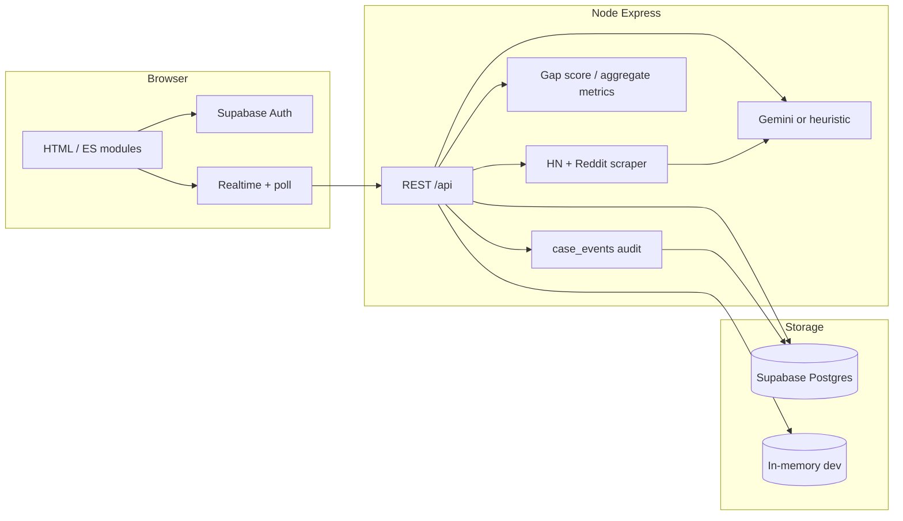

# BleMap Architecture

## System layers

## Request flows

### Submit (confirm-before-post)

1. `POST /api/submit/analyze` — AI validates and structures text; returns `draftId`.
2. User reviews topic, summary, domain, disclaimer.
3. `POST /api/submit/confirm` — persists case as **pending** (or merges duplicate).
4. Community `POST /api/cases/:id/confirm` — after 5 confirmations → **published** on matrix.

### Prospector

1. `GET /api/cases?view=prospector` — unclaimed published cases sorted by **gap score**.
2. Claim → propose solutions → accept → mark solved.

### Scrape (automation)

1. Cron or manual `POST /api/scrape/run` (secured with `CRON_SECRET` or signed-in user).
2. [`backend/ingestion/runScrapeJob.js`](../backend/ingestion/runScrapeJob.js) → **Hacker News** (default, free) and optional Reddit → [`promoteSignal`](../backend/ingestion/promoteSignal.js) → Gemini/heuristic → precase row + case (`SCRAPE_PUBLISH_MODE=auto` or `pending`).
3. `GET /api/ingestion/status` — last `scrape_runs` summary.

### Live updates

1. Mutations emit `case_events` rows (memory array or Supabase table).
2. `GET /api/activity/recent` and `GET /api/metrics/summary` power Home/Prospector/Matrix UI.
3. Frontend `blemap:data-changed` event bus + 60s polling; Supabase Realtime when `store=supabase`.

### Search

`GET /api/cases` accepts `q`, `domain`, `status`, `lifecycle_state`, `source`, `limit`, `offset` in addition to `view=matrix|prospector|pending`.

## Security

- Mutations require `Authorization: Bearer <supabase_jwt>`.
- Service role key only on server.
- RLS on Supabase per `database/migrations/002_intelligence.sql`.
- `case_events` migration: `database/migrations/005_case_events.sql`.

## Deployment

- **Local:** `npm run dev` (memory store default).
- **Vercel:** `api/index.js` exports Express app; cron hits `/api/scrape/run`.
- **Supabase:** Run migrations 001–005; enable Realtime on `cases`, `case_events`, `scrape_runs`.
