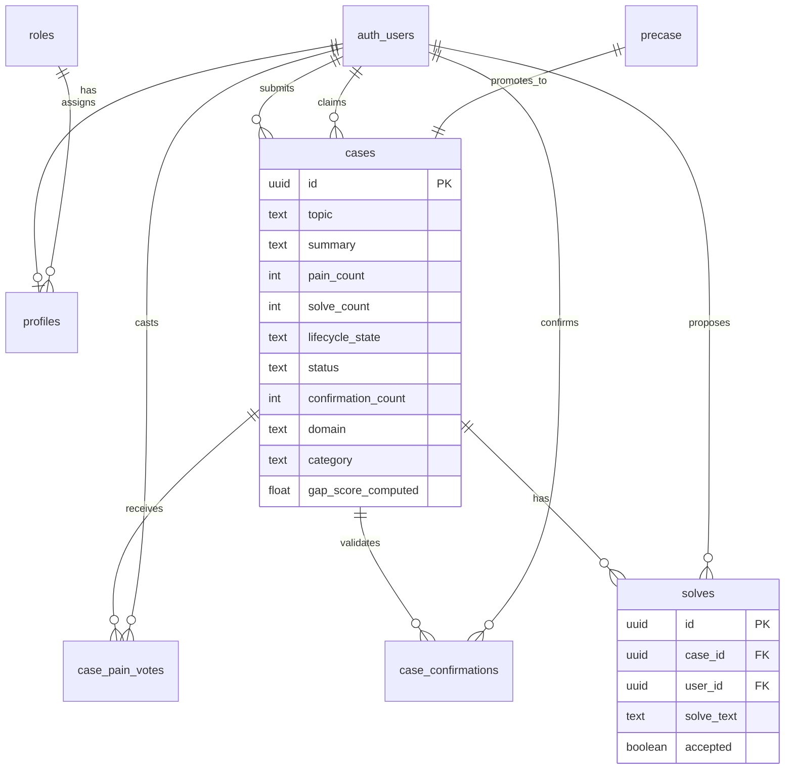

# Entity Relationship Diagram

```mermaid
erDiagram
  auth_users ||--o| profiles : has
  roles ||--o{ profiles : assigns
  auth_users ||--o{ cases : submits
  auth_users ||--o{ cases : claims
  cases ||--o{ case_pain_votes : receives
  cases ||--o{ case_confirmations : validates
  cases ||--o{ solves : has
  auth_users ||--o{ case_pain_votes : casts
  auth_users ||--o{ case_confirmations : confirms
  auth_users ||--o{ solves : proposes
  precase ||--|| cases : promotes_to

  cases {
    uuid id PK
    text topic
    text summary
    int pain_count
    int solve_count
    text lifecycle_state
    text status
    int confirmation_count
    text domain
    text category
    float gap_score_computed
  }

  solves {
    uuid id PK
    uuid case_id FK
    uuid user_id FK
    text solve_text
    boolean accepted
  }
```

## Gap score (computed, not stored)

`gap_score = f(pain_count, solve_count, has_accepted_solution)` — see `backend/lib/caseMetrics.js`.
